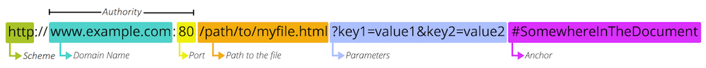

<!-- _class: titlepage -->
<style scoped>
img[alt~="API"] {
  display: block;
  margin: 0 auto;
}
</style>


<!--
Lundi matin, vous vérifiez votre emploi du temps, votre premier cours est dans deux heures, vous voulez encore rester enroulé bien au chaud dans votre couette et vous vous dites qu’en ce mois de février, partir profiter d'une semaine au ski ça serait plutôt mérité. Vous trouvez un hôtel au pied des pistes sur une application comparateur d'hôtels, et bingo vous en trouvez un peu en dessous de votre budget et qui à l'air assez sympa. Quelques cliques, un passage sur la page de validation de votre banque et le séjour est réservé.
Vous regardez votre montre, prochain cours dans 1h30. Suffisant pour regarder un autre épisode sur votre plateforme de streaming préféré ;-).


Nous avons maintenant l'habitude de voir passer sous nos yeux une grande quantité de données: les réseaux sociaux, les aggrégateurs, votre site bancaire... D'un point de vue extérieur, c'est assez simple: les informations arrivent et sont affichées à la demande; sauf que derrière cette apparente simplicité se cache de nombreux défis techniques !!! 
En effet, un gros travail est effectué afin de rendre cela possible, et l'un des concepts clé est les "API".

API, pour Application Programming Interface. Pour faire simple, c'est un moyen de communiquer entre deux applications distinctes ou entre deux composants d'une application.


Quel est le lien entre les réseaux sociaux, le site de ma banque, une plateforme de streaming et des API ?


Les API permettent d'exposer des méthodes standardisées et réutilisables qui permettent aux développeurs d'intégrer des fonctionnalités ou de mettre à disposition des données aux utilisateurs:
C’est parce que Google et Facebook, par exemple, exposent des API que d’autres développeurs peuvent utiliser dans leurs propres sites Internet pour s’occuper de l’inscription et de la connexion des utilisateurs à leur place.


Utilisez des API en tant que développeur:
En tant que développeurs, vous allez certainement consommer et / ou produire des APIs afin de réaliser des applications.
Il existe deux types d'API: les publiques et les privées.

Comme son nom l'indique, les API publiques sont utilisables par tout le monde sans réstriction. Cela permet donc d'avoir accès à toutes sortes de données et d'action:
* Vous souhaitez développer une application qui compte les calories de votre repas vous pouvez utiliser une API regroupant la liste ainsi que la valeur nutritive des aliments : https://fr.openfoodfacts.org/data.
* Vous développez une application nécessitant la lecture de playlist, spotify met à disposition des API https://developer.spotify.com/documentation/web-api/
* même l'état se met aux APIs avec l'open data https://www.data.gouv.fr/fr/, et l'utilisation est seulement limité par votre imagination.

Contrairement aux APIs publiques, l'accès aux APIs privées est restreinte à un groupe de personnes/application limités en raison du caractère sensible ou stratégique de l'information. En fonction de la sensibilité, ces API peuvent être utilisés par une société, ou par un service, voir par quelques personnes uniquement.
* Cela peut concerner la liste des clients d'une société,
* Les opérations d'un compte bancaire
* La rémunération des différents collaborateurs


Vous pouvez trouver une liste d'API publique sur https://github.com/public-apis/public-apis.

Pour résumer, les API :
* permettent d'exposer des données ou mettre à disposition un comportement
* sont standardisée et réutilisable
* peuvent être publique ou privée
-->
---
<!-- paginate: true -->
<!-- footer: API fondamentaux-->
# Les bases du web
<!--
0. Avant de continuer notre plongée dans le monde des API, il est nécessaire de comprendre les bases du web:-->
<!--
1. On identifie cette machine par un identifiant unique, qui est l'adresse IP.
Il est possible de communiquer avec n'importe qu'elle machine connectée à "internet" si l'on connait son IP.
Il existe un "annuaire" d'adresse IP, le DNS qui permet de donner un nom de domaine unique à une machine (comme google.fr).-->
 <!--
2. (petit tour de table pour savoir la différence entre les deux)
Internet: c'est le réseau, l'infrastructure.-->
 <!--
 3.Sir Timothy John Berners-Lee is an English computer scientist best known as the inventor of the World Wide Web. -->

- Internet est un réseau de réseaux informatiques, si une machine est connectée à un de ces réseaux alors elle est sur Internet.

- Pour la majorité des personnes, le web et internet sont les même choses ... mais pas pour des développeurs web tel que vous ^^. 

- Le web est une *"application"* déployée sur internet, c'est un système de documents hypertextes, c'est à dire liés entre eux, fonctionnant de façon décentralisée sur internet. 
 (Merci Tim Berners-Lee)


---
# Les bases du web
<!--1. => deux documents ne peuvent pas être adressés par la même URL-->
Le web est consititué de 3 élèments fondamentaux permettant de fonctionner:

- une **identification unique** des documents, via des url

- un **langage** decrivant les documents (HTML) 

- un **protocole de transfert** de document HTTP (Hypertext Transfer Protocol) 
<!-- 3. avec sa variante sécurisée HTTPS. HTTP est un protocole, une liste de régle et de standard permettant la communication entre un client et un serveur. Avec ces différents élèments, le web permet l'échange et le transfert de données sur internet: -->

---
# URLs

La cible d'une requête est une **ressource**, elle n'est pas typée, cela peut aussi bien être un document, une photo, une personne, un lieu, un article ...

Toute ressource est identifiée par une **URI** (Uniform Resource Identifier) utilisée par le protocole **HTTP** afin de l'identifier de façon unique.

---
# URLs

L'identité et l'emplacement de la ressource sur le web sont généralement détérminée via une **URL** (Uniform Resource Locator), qui est la forme la plus commune d'**URI**, que l'on connait aussi sous le nom d'addresse web.

Exemples:
https://www.decathlon.fr/
https://www.decathlon.fr/homme/vetements


---
<style scoped>
img[alt~="Client-Serveur"] {
  display: block;
  margin: 0 auto;
}
</style>
# URLs

Les URLs se structurent de la façon suivante:


*protocole://nom-de-domaine:port/chemin?paramètres#ancre*

---
# URLs
**Le protocole**

http:// constitue le protocole utilisé pour la communication entre le navigateur et le serveur. Il s'agit généralement de HTTP, ou de la version sécurisée HTTPS. 
Le web se base sur l'un ou l'autre de ces protocoles, cependant un navigateur est en mesure d'en gérer d'autres tels que le mailto (ouverture d'un client mail) ou ftp pour gérer le transfert de fichier.

---
# URLs
**L'autorité, ou nom de domaine**

www.decathlon.fr est le nom de domaine ou l'autorité qui gère cet espace de noms, dans l'exemple tous les sous domaine de decathlon.fr sont géré par l'entreprise du même nom. Il indique quel serveur Web est appelé. Il est aussi possible d'utiliser directement l'adresse IP, mais cela est mois pratique à manipuler pour les humains.

---
# URLs
**Le port**

Il indique la "porte" technique du serveur à utiliser pour accéder à une ressource sur un serveur. Généralement, il n'est pas nécessaire de la préciser puisque le serveur web utilisera par défaut les ports standards pour HTTP (port 80 pour HTTP et 443 pour HTTPS) pour permettre l'accès aux ressources. C'est uniquement dans le cas d'utilisation d'un port autre que celui par défaut qu'il est nécessaure de le spécifier dans l'URI.

---
# URLs
**Le chemin**

Il constitue le chemin d'accès à la ressource sur le serveur. Au début du web, le chemin représentait l'emplacement physique du fichier stocké sur le serveur, maintenant il s'agit d'une abstraction gérée par le serveur sans réelle existence physique.

---
# URLs
**Les paramètres**

Il est possible de fournir des paramètres additionnels au serveur pour le traitement de la requête.   Ces paramètres sont un ensemble de clés/valeurs séparé par le symbole "&", ce qui peut donner ""?param1=value1,value11&param2=value2...". Le serveur web peut utiliser ces paramètres pour affiner la requête avant de retourner la ressource au client. 

---
# URLs
**L'ancre**

"#Anchor" est une ancre qui pointe vers un "morceau" particulier de la ressource, elle constitue une sorte de pointeur à l'intérieur de la ressource.  

Au sein d'une page HTML, cela peut être un paragraphe, pour une video ou audio (cela peut être un temps indiqué).

---
# Les réponses
Une fois que vous avez une url à requêter, vous pouvez récupérer les informations disponibles sur la ressource.

Les données transmises, utilisent couramment le format **JSON** (JavaScript Object Notation), même si d'autres formats sont disponibles: **xml**, **csv**, **html**

---
# Le format JSON

C'est un format standard utilisé pour représenter des données structurées, il peut être utilisé quelque soit le langage!

Il stocke les données sous un format clé-valeur. Les données sont entourées d'accolades et chaque paire clé-valeur est envoyée sous la forme de chaine de caractères, entourés de guillemets.

Il permet aussi bien de travailler avec des tableaux que des objets complexes, ce qui fait de lui un format adapté au transfert de données.  

---
```json
{
	"teamName": "Justice League",
	"active": true,
	"members": [{

			"name": "Batman",
			"age": 55,
			"secretIdentity": "Bruce Wayne",
			"abilities": [
				"Martial art",
				"Weapon mastery",
				"Detective"
			]
		},
		{

			"name": "Superman",
			"age": 35,
			"secretIdentity": "Clark Kent",
			"abilities": [
				"Fly",
				"super speed",
				"Invulnerability"
			]
		}
	]
}
```
---
# Le format JSON

Le JSON est généralement considéré comme :

1. Plus facile à analyser avec du code.
2. Plus court.
3. Plus rapide à lire et à écrire pour les machines.
4. Très "léger" et efficace grâce à sa structure en arborescence et sa syntaxe simple.
 
---
# Les codes

Les codes de statut des réponses HTTP permettent d'indiquer si une requête HTTP a été exécutée **avec succès ou non**.
Les réponses sont regroupées en **cinq classes**:
1. Les réponses **informatives** (100 - 199),
2. Les réponses de **succès** (200 - 299),
3. Les messages de **redirection** (300 - 399),
4. Les erreurs du **client** (400 - 499),
5. Les erreurs du **serveur** (500 - 599).

---
# Les codes
*Quelque uns des codes les plus couramment utilisés*

**100 Continue**
Cette réponse intermédiaire indique que tout est OK pour le moment et que le client peut continuer sa requête ou l'ignorer si celle-ci est déjà finie.

**200 OK**
La requête a réussi. La signification du succès peut varier selon la méthode HTTP (création, suppression, mise à jour)

---
# Les codes
**201 Created**
La requête a réussi et une nouvelle ressource a été créée en guise de résultat. Il s'agit typiquement de la réponse envoyée après une requête PUT ou POST.

**204 No Content**
Il n'y a pas de contenu à envoyer pour cette requête, mais les en-têtes peuvent être utiles. L'agent utilisateur peut mettre à jour ses en-têtes en cache pour cette ressource en les remplaçant par les nouveaux.

---
# Les codes
**206 Partial Content**
Ce code de réponse est utilisé en réaction à l'en-tête Range (en-US) envoyé par le client pour séparer le téléchargement en plusieurs flux.

**301 Moved Permanently**
Ce code de réponse signifie que l'URL de la ressource demandée a été modifiée. Une nouvelle URL est donnée dans la réponse.

---
# Les codes
**307 Temporary Redirect**
Le serveur a envoyé cette réponse pour rediriger le client afin d'obtenir la ressource demandée via un autre URI, en utilisant la même méthode que précédemment. Ce code a la même sémantique que le code 302 Found, à l'exception près que l'agent utilisateur ne doit pas changer la méthode HTTP utilisée.
<!-- 307: si POST était utilisé dans la première requête, alors POST doit être utilisé dans la seconde -->

**400 Bad Request**
Cette réponse indique que le serveur n'a pas pu comprendre la requête à cause d'une syntaxe invalide.

---
# Les codes
**401 Unauthorized**
Bien que le standard HTTP indique « non-autorisé », la sémantique de cette réponse correspond à « non-authentifié » : le client doit s'authentifier afin d'obtenir la réponse demandée.

**403 Forbidden**
Le client n'a pas les droits d'accès au contenu, donc le serveur refuse de donner la véritable réponse.

---
# Les codes
**404 Not Found**
Le serveur n'a pas trouvé la ressource demandée.
<!-- 404: Ce code de réponse est principalement connu pour son apparition fréquente sur le web. -->

**500 Internal Server Error**
Le serveur a rencontré une situation qu'il ne sait pas traiter.

**502 Bad Gateway**
Le serveur, alors qu'il fonctionnait en tant que passerelle, n'a pas pu transmettre la demande.

---
# Les codes
**503 Service Unavailable**
Le serveur n'est pas prêt pour traiter la requête. Les causes les plus communes sont que le serveur est éteint pour maintenance ou qu'il est surchargé. 
<!-- 503: Notez qu'avec cette réponse, une page ergonomique peut expliquer le problème. Ces réponses doivent être utilisées temporairement et le champ d'en-tête Retry-After doit, dans la mesure du possible, contenir une estimation de l'heure de reprise du service. Le webmestre doit aussi faire attention aux en-têtes de mise en cache qui sont envoyés avec cette réponse (qui ne doivent typiquement pas être mis en cache). -->

**504 Gateway Timeout**
Cette réponse d'erreur est renvoyée lorsque le serveur sert de passerelle et ne peut pas donner de réponse dans les temps.

---
# Les codes

C'est ici une **selection** des codes de statuts de réponse les plus couramment rencontrés, pour trouverez l'ensemble des codes https://developer.mozilla.org/fr/docs/Web/HTTP/Status


---
# Les headers

Les headers HTTP permettent au **client et au serveur** de transmettre des informations supplémentaires, **lié au contexte**, avec la requête ou la réponse.

Un header est constitué de son nom et de sa valeur séparé par deux points ':'.
```
Content-Type: application/json
```

---
# Les headers
Les headers sont regroupés en:
- **header général:** s'applique à la fois à aux requête et aux réponses, mais sans rapport avec les données transmises . 
Cela peut être des données liées à la date, au cache, à la connexion.

- **header de reponse:** contient de informations complémentaires au sujet de la réponse, comme sont emplacement lors de la création d'une ressource, le serveur, la version ...

---
# Les headers
Les headers sont regroupés en:
<!-- Ces headers permettent aussi d'effectuer l'authentification et l'autorisation en cas d'accès à des ressources protégées (le header Authorization par exemple). -->
- **header de requête:** contient des informations sur la ressource demandées ou sur le client effectuant la demande.
Cela peut-être le format du body, les types de format acceptés par le client (Accept) ...

- **header d'entité:** contient des informations sur le corps de l'entité, tel que la longueur du contenu ou son type.

---
# Les verbes HTTP

Les verbes HTTP, ou méthodes de requêtes, permettent d'indiquer l'action à réaliser sur la ressource indiquée.  

Chacun d'entre eux implémente une sémantique différente, mais certaines fonctionnalités courantes peuvent être partagées par différentes méthodes.

---
# Les verbes HTTP
*Les verbes le plus couramment utilisés*

**GET**
La méthode GET récupère la representation de la ressource demandée. 
<!-- Les requêtes GET doivent uniquement être utilisées pour la récupération de données.-->

**POST**
La méthode POST est utilisée pour l'envoi d'une entité vers la ressource indiquée. Cela entraîne généralement un changement d'état.
<!-- La méthode POST est également utilisée pou déclencher des traitement sur le serveur : search, calculate, ... -->

---
# Les verbes HTTP
**PUT**
La méthode PUT remplace la ressource visée par le contenu de la requête.

**PATCH**
La méthode PATCH est utilisée pour appliquer des modifications partielles à une ressource.

**DELETE**
La méthode DELETE supprime la ressource visée.

---
# Les verbes HTTP
*Quelques verbes moins utilisés, mais qui existent*

**HEAD**
La méthode HEAD demande une réponse identique à une requête GET pour laquelle on aura omis le corps de la réponse (on a uniquement l'en-tête).

**CONNECT**
La méthode CONNECT établit un tunnel vers le serveur identifié par la ressource cible.

---
# Les verbes HTTP

**OPTIONS**
La méthode OPTIONS est utilisée pour décrire les options de communications avec la ressource visée.

**TRACE**
La méthode TRACE réalise un message de test aller/retour en suivant le chemin de la ressource visée.


---
# HTTP body

Le **body** HTTP contient les données transmises dans un message HTTP (requête ou réponse) immédiatement après les headers.

Tandis que les **headers** contiennent des **données complémentaires, et autres métadonnées**, le **body** contient quand à lui les **informations de la ressource référencée**.

>En cas de création de ressource, par exemple, le body du POST contient toutes les informations demandées pour effectuer l'action.

<!-- On vient de passer en revue les différentes éléments de base du protocole HTTP. C'est un protocole, c'est à dire une liste de règles et de bonnes pratiques qui permettant la communication entre un client et un serveur.

En se basant sur ce protocole, il est possible d'organiser et de structurer la communication (RPC over HTTP, API Rest ...), mais tout ces moyens se basent sur ce protocole. Une bonne connaissance de HTTP, permet de mieux comprendre comment fonctionnent les composants l'utilisant.-->