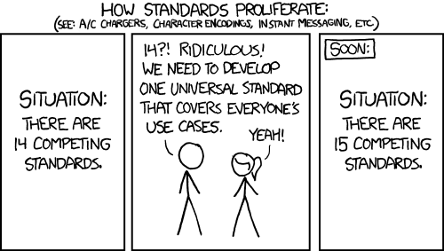

<!-- _class: lead -->
<style scoped>
img[alt~="Swagger"] {
  display: block;
  margin: 0 auto;
}
</style>


---
<!-- paginate: true -->
# Il est une fois une API
<!--
Supposons que nous soyons chargés de créer une API RESTful qui renverra un objet utilisateur basé sur l'ID utilisateur, par ex. http://myApi/user/123 renverra l'utilisateur avec l'ID 123.
-->
```
{
  id: 123,
  username: 'realFakeDoors',
  displayName: 'Real Fake Doors',
  email: 'getreal@fakedoors.com',
  accountStatus: 'verified'
}
```
---

<!--
Ce endpoint doit être consommé par d'autres développeurs de notre société dans le cadre d'une architecture de micro-services. Nous ne pouvons pas simplement laisser ce point de terminaison non documenté, car cela obligerait toute personne utilisant notre service à ouvrir et à lire notre code afin de comprendre si notre service correspond même à ce qu'elle recherche.

Nous devons donc documenter les points de terminaison que nous avons et le type d'objets qu'ils renvoient. Cependant, nous devons le faire d'une manière facile à lire pour un développeur, même s'il utilise un langage complètement différent pour utiliser notre API.

De plus, notre style de documentation peut être différent des styles de documentation des autres services de notre entreprise. Nous devrons donc au moins définir une norme pouvant être utilisée dans l'ensemble de nos services.

Définir une norme sans rechercher d'abord une norme existante peut toutefois entraîner des problèmes.
-->
# Les standards

<style scoped>
img[alt~="how_standards_proliferate"] {
  display: block;
  margin: 0 auto;
}
</style>



> C'est là qu'intervient la spécification Open API.

---
# OpenAPI

La spécification OpenAPI (OAS) définit une interface standard indépendante du langage pour les API RESTful qui permet aux humains et aux ordinateurs de découvrir et de comprendre les capacités du service sans accéder au code source, à la documentation ou via l'inspection du trafic réseau.

Donc, fondamentalement, OpenAPI est un moyen standardisé de définir une API au format JSON ou YAML. 

---
# Premier pas avec une swagger

Afin de faciliter l'écriture des différentes requêtes pour la consommation de leurs services, une documentation accompagne généralement les endpoints exposés.

Cette documentation peut prendre la forme d'une liste des différents endpoints avec le description de la ressource, des paramètres et des headers nécessaires pour effectuer l'appel. Les différentes réponses possibles sont aussi documentées afin de faciliter la compréhension du retour effectué.

---
# Premier pas avec une swagger

Une autre forme possible est la "**swagger**". Cette "**swagger**", en plus de formaliser la manière de faire appel à la ressource et des codes de retour, permet généralement d'effectuer des appels de manière rapide, en générant les curls adaptés.

---
# Premier pas avec une swagger

De plus, Swagger fournit un outil appelé Swagger UI. Il s'agit d'une interface utilisateur Web simple que vous pouvez configurer pour afficher et même essayer des exemples de votre spécification OpenAPI. Vous pouvez choisir de l'afficher partout où vous pourriez afficher un site Web, que ce soit sur l'intranet de votre entreprise, sur un site Web destiné aux développeurs si votre API est accessible au public, ou mon préféré, le conditionner comme point de terminaison racine de l'API elle-même.

---
# TP - Adoption d'un animal

L'application https://petstore.swagger.io/ permet de gérer une animalerie à partir de ses APIs.

L'objectif du TP est de créer:
- Un scénario postman ajoutant des animaux.
- Un scénario postman permettant à un client d'adopter un animal dans le centre choisi.
- Bonus: Un scénario postman créant deux stores, d'ajouter un nombre aléatoire d'animaux, et de supprimer celui en ayant le moins.
