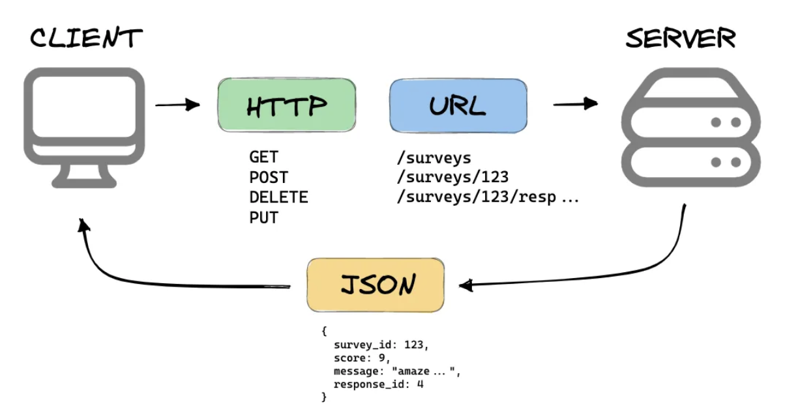
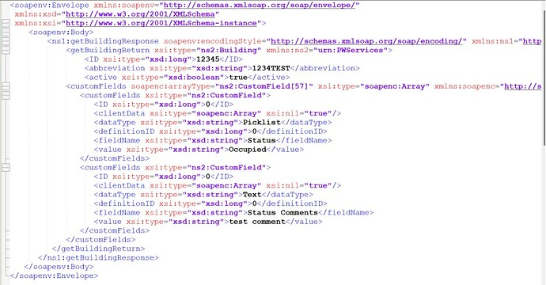

<!-- _class: title -->

<!-- 
Depuis l'invention d'internet, nous avons utilisé différentes applications et des pages web pour visualiser de la donnée de diverses ressources.
Cependant, vous êtes vous déjà posé la question, d'où provient cette donnée? Eh bien, elles provient de serveurs!
Dans cette partie du cours nous allons discuter de comment un client communique avec les serveurs pour extraire les informations nécessaire.
-->

---
<!-- paginate: true -->
<!-- footer: API Rest principes-->

# Le besoin d'APIs REST
<!-- 
Prenons l'exemple d'une application qui liste les films projetés au cinéma dans chaque ville.  
De toute évidence, cette application a besoin de beaucoup de données et de plus la donnée affichée à l'utilisateur n'est jamais statique.
Elle est toujours contextualisée: à la ville, aux horaires, voir à la langue de l'utilisateur. Par conséquent la donnée est toujours changeante dans l'application.
Cette donné est issue de serveurs, plus souvent appelé serveur-web. Donc le client demande aux serveurs les informations nécessaires, via une API, et le serveur envoie la réponse au client.
-->

---

# Le besoin d'APIs REST
<!--
Avant 2000, il n'y avait pas de standard sur comment designer une API ou comment en utiliser une.
A cette époque, la plus part des développeurs devaient se débrouiller avec SOAP pour intégrer avec une API. Cette technologie notoirement complèxe à construire, à gérer et à déboguer!
-->

<!--
Le but affiché était simplement de créer une norme permettant à deux serveurs de communiquer et d'échanger des données partout dans le monde. Ils ont donc conçu un ensemble de principes, propriétés et contraintes qu'ils ont nommé REST (merci Roy Fielding et ses collègues)
-->

---
# C'est quoi une API REST
5 grands principes définissent une API REST:
- Stateless
- Client-Server
- Interface uniforme
- Cacheabilité
- Système en couches
<!--
REST propose de créer un objet des données demandées par le client et d'envoyer les valeurs de l'objet en réponse à l'utilisateur. Par exemple, si l'utilisateur demande un film à Dunkerque à un certain endroit et à une certaine heure, vous pouvez créer un objet côté serveur.
Donc, ici, vous avez un objet et vous envoyez l'état d'un objet. C'est pourquoi REST est connu sous le nom de REpresentational State Transfer.

Les données sont renvoyées sous forme de format structuré, plutôt que la page Web complète.

Ainsi les données renvoyées par le serveur, en réponse à la requête du client, sont soit au format JSON, soit XML. Les formats JSON et XML ont tous deux une structure hiérarchique appropriée des données.
-->

---
# Stateless

Les requêtes envoyées d'un client à un serveur contiennent toutes les informations nécessaires pour que le serveur comprenne les requêtes envoyées par le client. 
 
De quelles manières:
- L'URL
- les paramètres
- le corps
- les en-têtes
<!--
L'URL est utilisée pour identifier de manière unique la ressource et le corps contient l'état de la ressource demandeuse.  
Une fois que le serveur a traité la demande, une réponse est envoyée au client via le corps, le statut ou les en-têtes.
-->

---
#  Client-Server
Le modèle de conception client-serveur applique le principe de séparation des préoccupations : séparer les préoccupations d'interface utilisateur des préoccupations de stockage de données.  

La séparation permet aux composants d'évoluer indépendamment , ce qui est nécessaire dans un environnement à l'échelle d'Internet qui implique plusieurs domaines organisationnels.

---
# Interface uniforme
La contrainte d'interface uniforme est fondamentale pour la conception de tout système RESTful.  

Il simplifie et découple l'architecture, ce qui permet à chaque partie d'évoluer indépendamment.

---
# Interface uniforme
Les quatre contraintes pour cette interface uniforme sont :

1. **Identification des ressources dans les demandes**
Les ressources individuelles sont identifiées dans les demandes, par exemple à l'aide d'URI dans les services Web RESTful. Les ressources elles-mêmes sont conceptuellement séparées des représentations qui sont renvoyées au client. Par exemple, le serveur peut envoyer des données de sa base de données au format XML ou JSON, dont aucun n'est la représentation interne du serveur.

---
# Interface uniforme
2. **Manipulation de ressources via des représentations** 
Lorsqu'un client détient une représentation d'une ressource, y compris les métadonnées attachées, il dispose de suffisamment d'informations pour modifier ou supprimer l'état de la ressource.
3. **Messages autodescriptifs**
Chaque message comprend suffisamment d'informations pour décrire comment traiter le message.

---
# Interface uniforme
4. **Hypermédia en tant que moteur d'état de l'application (HATEOAS)**
 Après avoir accédé à un URI initial pour l'application REST, un client REST devrait alors pouvoir utiliser dynamiquement les liens fournis par le serveur pour découvrir toutes les ressources disponibles dont il a besoin. Au fur et à mesure de l'accès, le serveur répond par un texte contenant des hyperliens vers d'autres ressources actuellement disponibles. Il n'est pas nécessaire que le client soit codé en dur avec des informations concernant la structure ou la dynamique de l'application.

---
#  Cacheabilité
Les clients et les intermédiaires peuvent mettre en cache les réponses.  
Les réponses doivent, implicitement ou explicitement, se définir comme pouvant ou non être mises en cache pour empêcher les clients de fournir des données obsolètes ou inappropriées en réponse à d'autres demandes.  

Une mise en cache bien gérée élimine partiellement ou complètement certaines interactions client-serveur, améliorant encore l'évolutivité et les performances.
<!-- https://www.youtube.com/watch?v=AJT5EJP_QmQ -->
---
# Système en couches
Un client ne peut généralement pas dire s'il est connecté directement au serveur final ou à un intermédiaire en cours de route.  

Si un proxy ou un équilibreur de charge est placé entre le client et le serveur, cela n'affectera pas leurs communications et il ne sera pas nécessaire de mettre à jour le code du client ou du serveur.
<!-- Les serveurs intermédiaires peuvent améliorer l'évolutivité du système en permettant l'équilibrage de charge et en fournissant des caches partagés. 
En outre, la sécurité peut être ajoutée en tant que couche au-dessus des services Web, séparant la logique métier de la logique de sécurité. L'ajout de la sécurité en tant que couche distincte applique les politiques de sécurité. 
-->
Enfin, les serveurs intermédiaires peuvent appeler plusieurs autres serveurs pour générer une réponse au client.
