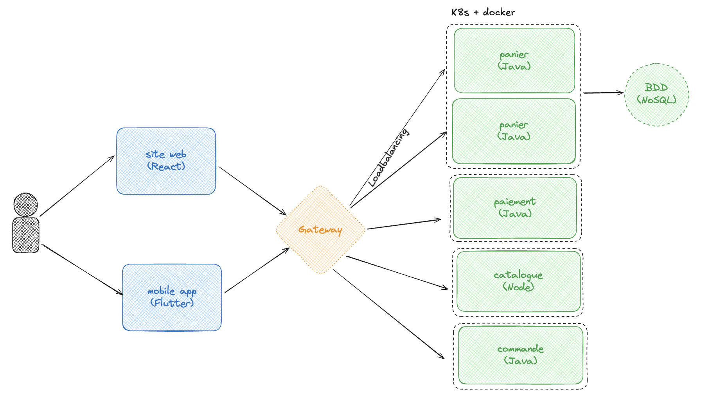

<!-- _class: title -->
<style scoped>
img[alt~="Microservice"] {
  display: block;
  margin: 0 auto;
}
</style>


---
<!-- paginate: true -->
<!-- footer: Microservice & architecture-->

# Monolithe

- Un monolithe est une architecture logicielle dans laquelle **tous les composants** d'une application sont regroupés **dans un seul et même code source**.

- Toutes les fonctionnalités de l'application sont gérées par un seul et même socle applicatif, qui peut être difficile à maintenir et à mettre à jour à mesure que l'application évolue. 

- Les monolithes sont souvent utilisés pour des applications de taille moyenne à grande, car ils peuvent être plus simples à développer et à déployer que des architectures plus complexes telles que les micro-services.

---
# Microservice

- Les micro-services, en revanche, sont une architecture logicielle dans laquelle une application est décomposée en de **nombreux services indépendants** qui peuvent être **développés, déployés et mis à jour séparément les uns des autres**. 

- Chaque micro-service est conçu pour gérer une fonctionnalité spécifique de l'application et peut communiquer avec les autres micro-services via des API bien définies. 

- Cette architecture offre une plus grande flexibilité et une plus grande évolutivité que les monolithes, car elle permet de mettre à jour et de déployer les micro-services de manière indépendante, ce qui peut rendre l'ensemble du système plus résilient et plus facile à maintenir.

---
# Avantages - inconvénients

- Les monolithes peuvent être plus simples à mettre en place et à déployer, mais ils peuvent devenir difficiles à maintenir à mesure que l'application se développe. 

- Les micro-services peuvent être plus complexes à mettre en place et à déployer, mais ils offrent une plus grande flexibilité et une plus grande évolutivité à mesure que l'application se développe. L'application est décomposée en de nombreux services indépendants qui peuvent être développés, déployés et mis à jour séparément.

---
# Frontend et Backend 

**Frontend** : La partie visible de l'application que l'utilisateur interagit avec. Elle comprend tout ce qui est rendu sur l'écran, comme les boutons, les menus, les formulaires, etc. C'est ce qu'on appelle aussi le "côté client".

**Backend** : La partie invisible de l'application qui gère la logique métier, les traitements des données, les interactions avec la base de données et les services externes. C'est ce qu'on appelle le "côté serveur".

---
# Frontend : Composition et technologies
- Utilise des technologies telles que HTML, CSS et JavaScript pour créer des interfaces utilisateur dynamiques et réactives.

- Les frameworks populaires incluent React, Angular, Vue.js, qui facilitent le développement d'applications complexes en fournissant des composants modulaires et réutilisables.

- Principal objectif : offrir une expérience utilisateur fluide et intuitive.

---
# Backend : Composition et technologies
- Écrit en utilisant divers langages comme Node.js, Python (Django, Flask), Java (Spring), Ruby (Ruby on Rails), etc.

- S'occupe des requêtes de l'utilisateur, de la gestion des bases de données (SQL, NoSQL), de la logique métier et de la sécurité.

- Gère la communication avec le frontend via des API (REST, GraphQL).

---
# Communication entre Frontend et Backend
- Utilisation des API pour échanger des données entre le frontend et le backend.

- Les requêtes envoyées par le frontend sont traitées par le backend, qui répond avec des données ou des résultats de traitement.

- Protocoles couramment utilisés : HTTP/HTTPS, avec des formats de réponse comme JSON et XML.

---
# Exemple

Application de gestion des tâches :
- Le frontend permet à l'utilisateur de créer, modifier et supprimer des tâches via une interface conviviale.

- Le backend reçoit les demandes, les enregistre dans une base de données, applique des règles métier (comme la validation des entrées), et renvoie des réponses au frontend.

---
# Résumé

Le **frontend** et le **backend** sont deux parties **complémentaires** d'une même application. 
Le **frontend** est ce que l'utilisateur **voit** et avec lequel il **interagit**, tandis que le **backend** est le moteur qui permet au frontend de fonctionner en **traitant les données et les opérations** nécessaires.

---
# Architecture : cas concret

Decathlon souhaite creer un service de gestion du panier client commun à tous ses services. Ce micro-service pourra être consommé par des frontends différents.
**Proposer une architecture qui intègre ce service dans l'eco-système Decathlon.**

<!-- Questions pertinantes pour comprendre le besoin
How many users ? (Load)
How many carts per users ?
Persistent (From a system to an other)
Logged in / logged out ?
Multi device
Read / Write ratio ?
Front back link ?
Multi country ? Multi cloud providers ?
 -->

---
<!-- _class: title -->
<!-- paginate: false -->
 <!-- footer: "" -->
<style scoped>
img[alt~="Archi-cart"] {
  display: block;
  margin: 100 auto;
}
</style>



<!-- https://excalidraw.com/#json=hS5Xgn9u97c35VqfDKL8l,lcnDUBJ9ikxRJCjXuFe1tg -->

---
<!-- paginate: true -->
<!-- footer: Microservice & architecture-->
# Architecture : Structure du panier
```JSON
{
  "id": uuid,
  "items"*:[
    {
    "id"*: integer
    "quantity"*: integer
    }
  ],
  "price": integer,
  "clientId" : uuid,
  "state": string
}
```
> GET /v1/carts/$id


---
# Architecture : créer un panier

```JSON
{
  "items"*:[
    {
    "id"*: integer
    "quantity"*: integer
    }
  ],
  "clientId" : uuid,
}
```

> POST /v1/carts {items:[{ id: 12389793, quantity : 1}]}


---
# Architecture : modifier un panier
```JSON
{
  "items"*:[
    {
    "id"*: integer
    "quantity"*: integer
    }
  ],
  "clientId" : uuid,
}
```
> POST/PUT /v1/carts/$id {items:[{ id: 12389793, quantity : 2}, clientId: hjdh-6532 ]}