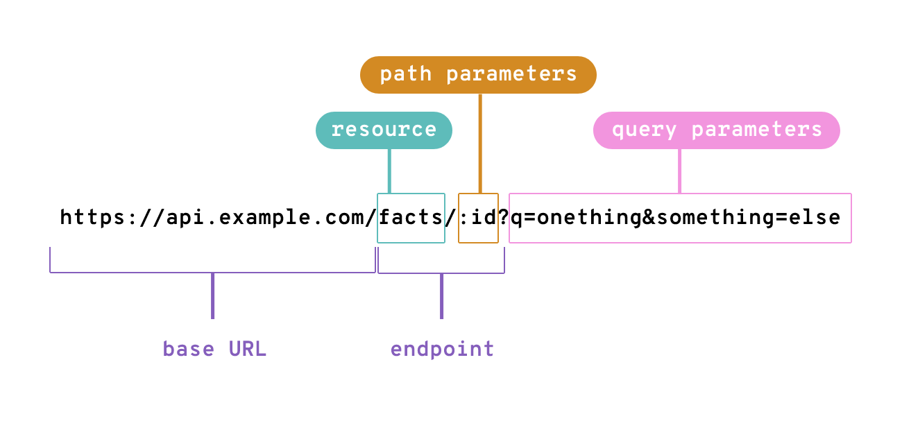

---
<!-- paginate: true -->
<!-- footer: Ressources & sous-ressources-->
# Ressource
Le principe de ressource est l'un des concepts clés de l'architecture REST (Representational State Transfer), qui est un style d'architecture pour les systèmes web. Dans une API REST, chaque ressource est considérée comme un objet identifiable avec un identifiant unique (URI ou Uniform Resource Identifier) qui peut être utilisé pour accéder, créer, modifier ou supprimer la ressource.

---
# Ressource
Une ressource peut être n'importe quoi, comme une photo, une vidéo, un utilisateur, un article, etc. Le principe de ressource implique que chaque ressource doit être accessible via un URI unique et qu'il doit y avoir un ensemble standardisé d'opérations que l'on peut effectuer sur cette ressource. Ces opérations sont souvent appelées méthodes HTTP, et les méthodes les plus courantes sont :

- **GET** : pour récupérer une ressource existante.
- **POST** : pour créer une nouvelle ressource.
- **PUT** : pour modifier une ressource existante.
- **DELETE** : pour supprimer une ressource existante.

---
# Interface

L'utilisation du principe de ressource dans une API REST permet de créer des interfaces web qui sont intuitives et faciles à comprendre pour les développeurs. En effet, les développeurs peuvent utiliser les URIs pour identifier et manipuler les ressources de manière cohérente et standardisée, ce qui facilite la création d'applications interopérables.

En outre, le principe de ressource dans une API REST permet de séparer l'interface utilisateur de la logique de l'application. En effet, une API REST peut être utilisée par différents clients, tels que des applications web, mobiles, ou encore des intégrations tierces, qui peuvent tous utiliser les mêmes ressources pour accéder aux données de l'application.

---
# Résumé

En résumé, le principe de ressource est l'un des **concepts clés de l'architecture REST**, qui consiste à considérer chaque objet ou **entité de l'application comme une ressource unique, **accessible via un URI** et avec un ensemble standardisé d'opérations que l'on peut effectuer dessus. 
L'utilisation de ce principe facilite la création d'interfaces web cohérentes et standardisées, ainsi que la séparation de la logique de l'application et de l'interface utilisateur.

---
# Sous-ressource
Une sous-ressource est une ressource qui dépend d'une autre ressource dans une API REST. Concrètement, cela signifie qu'une sous-ressource est accessible à partir d'une ressource parente en utilisant une URI relative.

---
# Exemple
Par exemple, supposons que nous avons une API REST pour une application de commerce électronique qui contient une ressource pour les commandes. Chaque commande est identifiée par un identifiant unique (URI). Pour accéder aux détails d'une commande, nous pouvons utiliser l'URI de la commande, par exemple GET /orders/123. Cependant, chaque commande peut également avoir des sous-ressources associées, telles que les articles de la commande ou l'adresse de livraison. Ces sous-ressources peuvent être accessibles en utilisant des URI relatifs, par exemple GET /orders/123/items pour accéder à la liste des articles de la commande 123.

---
# Organisation
En général, l'utilisation de sous-ressources dans une API REST permet de mieux organiser les ressources en fonction de leur hiérarchie et de leur relation les unes avec les autres. Cela permet également de rendre l'API plus facile à comprendre et à utiliser pour les développeurs, car elle suit une structure cohérente et prévisible.

Il convient de noter que les sous-ressources ne sont pas obligatoires dans une API REST, mais elles peuvent être utiles pour représenter des relations entre les ressources et pour faciliter l'accès à des informations spécifiques.