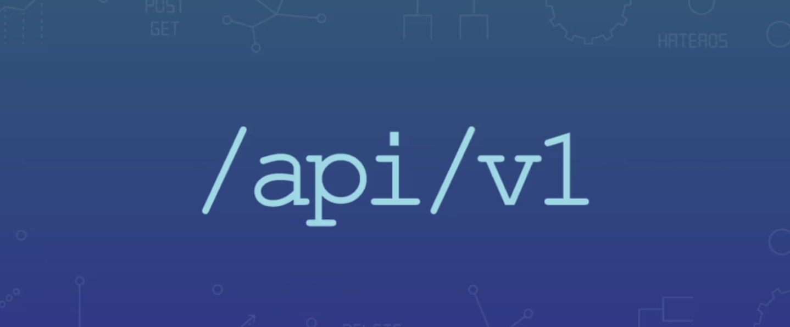

<style scoped>
img[alt~="Versioning"] {
  display: block;
  margin: 0 auto;
}
</style>



---
<!-- paginate: true -->
<!-- footer: Versioning-->
# Qu'est-ce que le versioning d'API ?
- Le versioning d'API est une pratique qui consiste à gérer différentes versions d'une même API. Cela permet aux développeurs de modifier et d'améliorer l'API sans interrompre les services existants utilisés par les clients.

- Chaque version d'une API correspond à un ensemble de fonctionnalités et de comportements définis à un moment donné.

---
# Pourquoi utiliser le versioning d'API ?

---
# Pourquoi utiliser le versioning d'API ?
- **Maintenir la compatibilité** : Les modifications apportées à l'API (comme l'ajout de nouvelles fonctionnalités, la modification de la structure des réponses, ou la suppression de fonctionnalités obsolètes) peuvent être introduites sans perturber les utilisateurs actuels.

- **Faciliter la transition** : Les clients peuvent passer progressivement d'une ancienne version à une nouvelle, permettant une adaptation plus fluide.

- **Améliorer la gestion** : Permet aux développeurs de gérer efficacement le cycle de vie des versions d'une API et de planifier des mises à jour majeures ou mineures.

---
# Les différentes stratégies de versioning

---
# Les différentes stratégies de versioning

**URL**  : La version est spécifiée dans l'URL de l'API.
> https://api.exemple.com/v1/ressource

**En-tête de requête** : La version est indiquée dans les en-têtes HTTP.
> Accept: application/vnd.exemple.v1+json

**Paramètre de requête** : La version est précisée dans les paramètres.
> https://api.exemple.com/ressource?version=1

**Sous-domaine** : Chaque version est associée à un sous-domaine.
> https://v1.api.exemple.com/ressource

---
# Bonnes pratiques de versioning

---
# Bonnes pratiques de versioning
- Versionner uniquement lors de changements significatifs : Introduire une nouvelle version pour des modifications majeures qui impactent la structure ou le comportement de l'API.

- Documenter chaque version : Assurer que chaque version soit accompagnée d'une documentation claire et à jour.

- Gérer la dépréciation : Informer les utilisateurs des versions obsolètes et prévoir un plan de transition avant la suppression d'une version.

---
# Exemple illustratif

Une API de gestion des utilisateurs commence avec ```v1``` qui propose des fonctionnalités de base. Plus tard, ```v2``` est introduite avec de nouvelles options de tri et de filtrage, mais l'ancienne version reste accessible pour les anciens clients.

---
# Conclusion

Le versioning d'API est essentiel pour le maintien de la stabilité et de la compatibilité d'une API tout en permettant l'évolution et l'amélioration continue de ses fonctionnalités. Une bonne stratégie de versioning assure une transition sans heurts pour les clients et permet une gestion efficace du cycle de vie de l'API.