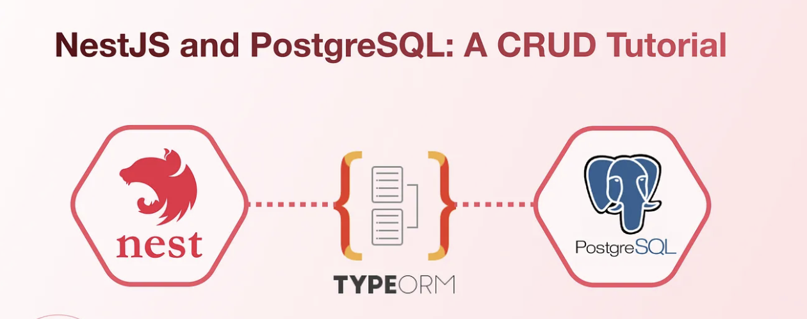

<style scoped>
img[alt~="ORM"] {
  display: block;
  margin: 0 auto;
}
</style>



---
<!-- paginate: true -->
<!-- footer: TP ORM-->

# Objective

In this hands-on, you will enrich your initial API with a DB. 

---
# PostgreSQL & PgAdmin installation

**PostgreSQL:** PostgreSQL is a powerful open-source relational database. 
https://www.postgresql.org/download/

**PgAdmin:** PgAdmin is a popular open-source administration and development platform for PostgreSQL databases. It offers a user-friendly graphical interface that allows users to manage and interact with PostgreSQL databases efficiently.
https://www.pgadmin.org/download/

---
# Install the required packages

```bash
npm install @nestjs/typeorm typeorm pg
```

We have installed 3 packages @nestjs/typeorm, typeorm, and pg. 

@nestjs/typerorm package is used to get typeOrm modules and other important modules to work with typeOrm. We have also installed pg, which helps to connect and communicate with the Postgresql database.

---
# Connect the database
```Typescript
import { Module } from '@nestjs/common';
import { TypeOrmModule } from '@nestjs/typeorm';
import { AppController } from './app.controller';
import { AppService } from './app.service';

@Module({
  imports: [
    TypeOrmModule.forRoot({
      type: 'postgres',
      host: 'localhost',
      port: 5432,
      password: 'simform',
      username: 'postgres',
      entities: [],
      database: 'postgres',
      synchronize: true,
      logging: true,
    }),
  ],
  controllers: [AppController],
  providers: [AppService],
})
export class AppModule {}
```
---
# Start your server

You can run the below command to check whether your app is connected to the database or not
```bash
npm run start:dev
```

> if you do not get any error then you have successfully connected with database.

---
# Create Resource

Now, you can create a resource named ‘user’; we will perform CRUD operations for the User; you can use the below command to create the resource.

```bash
nest g res user
```

> Select Rest API and type Y to include all the endpoints.

---
# Install class-validator & class-transformer

You can install class-validator and class-transformer using the below command. class-validator and will help you to validate the request body. you can use class validator decorator while creating DTO for User.

```bash
npm i --save class-validator class-transformer
```

---
# Create entity of the user
```Typescript
import { Column, Entity, PrimaryGeneratedColumn } from 'typeorm';

@Entity()
export class User {
  /**
   * this decorator will help to auto generate id for the table.
   */
  @PrimaryGeneratedColumn()
  id: number;

  @Column({ type: 'varchar', length: 30 })
  name: string;

  @Column({ type: 'int' })
  age: number;

  @Column({ type: 'enum', enum: ['m', 'f', 'u'] })
  gender: string;
}
```

---
# Create DTO of the user

```Typescript
import { IsAlphanumeric,IsEmail, IsEnum, IsInt,
  IsNotEmpty,IsString, Matches, MinLength } from 'class-validator';
export class CreateUserDto {
  @IsNotEmpty()
  @MinLength(3, { message: 'Username must have atleast 3 characters.' })
  @IsAlphanumeric(null, {
    message: 'Username does not allow other than alpha numeric chars.',
  })
  username: string;

  @IsNotEmpty()
  @IsEmail(null, { message: 'Please provide valid Email.' })
  email: string;
}
```

---
# Update the Service file and controller

```Typescript
@Injectable()
export class UserService {
  constructor(
    @InjectRepository(User) private readonly userRepository: Repository<User>,
  ) {}

  /**
   * this is function is used to create User in User Entity.
   */
  createUser(createUserDto: CreateUserDto): Promise<User> {
    const user: User = new User();
    user.name = createUserDto.name;
    user.age = createUserDto.age;
    return this.userRepository.save(user);
  }
  ...
```

---
# Update user module

```Typescript
import { Module } from '@nestjs/common';
import { UserService } from './user.service';
import { UserController } from './user.controller';
import { TypeOrmModule } from '@nestjs/typeorm';
import { User } from './entities/user.entity';

@Module({
  imports: [TypeOrmModule.forFeature([User])],
  controllers: [UserController],
  providers: [UserService],
})
export class UserModule {}
```

---
# Update user Entity

```Typescript
import { Module } from '@nestjs/common';
import { TypeOrmModule } from '@nestjs/typeorm';
import { AppController } from './app.controller';
import { AppService } from './app.service';
import { UserModule } from './user/user.module';
import { AuthModule } from './auth/auth.module';
import { User } from './user/entities/user.entity';

@Module({
  imports: [
    TypeOrmModule.forRoot({
      type: 'postgres',
      host: 'localhost',
      port: 5432,
      password: 'simform',
      username: 'postgres',
      entities: [User], // here we have added user enitity in entities array
      database: 'pgWithNest',
      synchronize: true,
      logging: true,
    }),
    UserModule,
    AuthModule,
  ],
  controllers: [AppController],
  providers: [AppService],
})
export class AppModule {}
```

---
# Update the service function name in the controller file

```Typescript
...
@Controller('user')
export class UserController {
  constructor(private readonly userService: UserService) {}

  /**
   * Post decorator represents method of request as we have used post decorator the method of this API will be post.
   * so the API URL to create User will be
   * POST http://localhost:3000/user
   */
  @Post()
  create(@Body() createUserDto: CreateUserDto) {
    return this.userService.createUser(createUserDto);
  }

  /**
   * we have used get decorator to get all the user's list so the API URL will be
   * GET http://localhost:3000/user
   */
  @Get()
  findAll() {
    return this.userService.findAllUser();
  }
...
```

---
# Let’s Test an API
> POST http://localhost:3000/user
```JSON
{
  "name": "John Doe",
  "username": "jd",
  "email": "jd@email.com",
  "age": 24,
  "password": "jdPWD",
  "gender": "m"
}
```
> GET http://localhost:3000/user
