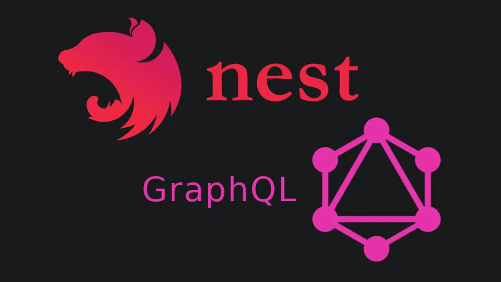

<!-- _class: titlepage -->
<style scoped>
img[alt~="GraphQL"] {
  display: block;
  margin: 0 auto;
}
</style>



---
<!-- paginate: true -->
<!-- footer: TP GraphQL-->
 # Nest.js Installation

> $ npm i -g @nestjs/cli
> $ nest new nest-graphql

We’ll be implementing Express and Apollo server, so let’s start by installing the required packages:
> $ cd nest-graphql
> $ npm i @nestjs/graphql @nestjs/apollo graphql apollo-server-express apollo-server-core

---
# Configure our GraphQL server
<!--autoSchemaFile permet de générer automatiquement un fichier de schéma en fonction des types et résolvers définis dans le code.
Le fichier schema.gql peut être utilisé pour explorer l'API avec des outils comme GraphiQL ou Apollo Studio. -->
To use the code first approach, start by adding the autoSchemaFile property to the options object.
```Typescript
import { ApolloDriver, ApolloDriverConfig } from '@nestjs/apollo';
import { Module } from '@nestjs/common';
import { GraphQLModule } from '@nestjs/graphql';
import { join } from 'path';
import { AppController } from './app.controller';
import { AppService } from './app.service';

@Module({
  imports: [GraphQLModule.forRoot<ApolloDriverConfig>({
    driver: ApolloDriver,
    autoSchemaFile: join(process.cwd(), 'src/schema.gql'),
  }),
  ],
  controllers: [AppController],
  providers: [AppService],
})
export class AppModule {}
```
---
# Create ressource
> nest g res user

Select GraphQL (code first) and type Y

Now add the following code inside the User Resolver class
```typescript
@Query((returns) => String)
 helloWorld() {
 return ‘Hello World’;
 }
 ```
 Notice that the UserModule class has already been added in the AppModule file, this is how powerful the nest cli is.

 ---
 # Run your first query
 Launch the server
 > npm run start:dev

Go to url 
> http://localhost:3000/graphql

Write our first query
> query { helloWorld }

---
# Use ORM
>npm install @nestjs/typeorm typeorm pg


```Typescript
TypeOrmModule.forRoot({
      type: 'postgres',
      host: 'localhost',
      port: 5432,
      password: 'simform',
      username: 'postgres',
      entities: [User],
      database: 'postgres',
      synchronize: true,
      logging: true,
    }),
```