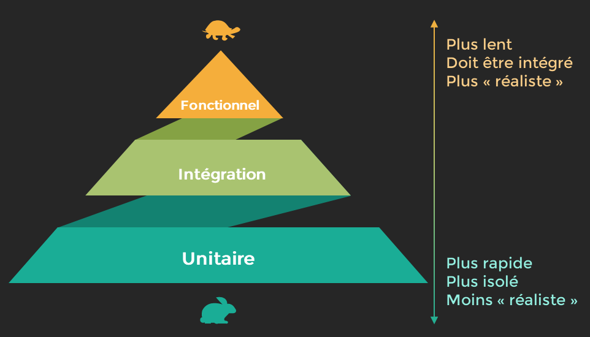
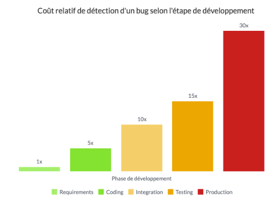
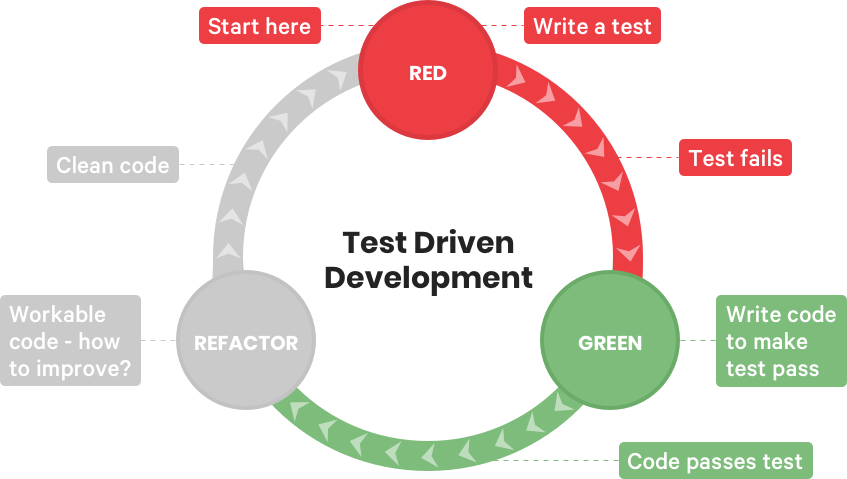

<!-- _class: titlepage -->

---
<!-- paginate: true -->
<!-- footer: Tester une API-->

# Context

Dans le monde du développement logiciel moderne, les tests sont cruciaux pour garantir la qualité des applications

---
# Importance des métriques

**Impact des métriques de qualité logicielle**
 - Amélioration de la fiabilité et de la robustesse des logiciels.
 - Réduction des bugs et des défauts, ce qui contribue à une meilleure expérience utilisateur.
- Aide à la prise de décision en fournissant des données objectives sur la performance et la qualité du logiciel.

---
# Importance des métriques

**Importance d'utiliser des métriques**
 - Facilite la communication entre les membres de l'équipe de développement et les parties prenantes.
 - Aide à définir des objectifs mesurables pour l'amélioration continue des processus de développement.
 - Contribue à l'optimisation des ressources en identifiant les domaines nécessitant une attention particulière.
 - Favorise la confiance des utilisateurs et la réputation de l'entreprise en livrant des produits de haute qualité.

---
# Métriques de qualité logicielles

Des indicateurs utilisés pour évaluer la qualité et la performance des logiciels.

**Quels indicateurs de qualité pouvez-vous me citer?**

---
# Définition des métriques

Des indicateurs utilisés pour évaluer la qualité et la performance des logiciels.

**Quels indicateurs de qualité pouvez-vous me citer?**
- fiabilité
- maintenabilité
- performance
- couverture de test
- sécurité

---
# Fiabilité

**Définition**

Capacité d'un logiciel à fonctionner sans erreur pendant une période donnée.

**Exemples**
- taux d'erreurs
- temps moyen entre les pannes (MTBF)

---
# Maintenabilité

**Définition** 

Facilité avec laquelle un logiciel peut être modifié ou corrigé.

**Exemples**
- taux de complexité cyclomatique
- Taux de couverture de code

---
# Performance

**Définition**
Capacité d'un logiciel à répondre efficacement aux demandes de l'utilisateur.

**Exemples** 
- temps de réponse
- utilisation des ressources (CPU, mémoire)
- capacité de montée en charge

---
# Conséquences des défauts logiciels
**Quels impacts sur les projets et les utilisateurs?**
<!--Demander quelles conséquences ils ont en tête. -->

---
<!-- Parlons maintenant des répercussions financières des défauts logiciels. -->
# Coûts

**Impacts**
 - Les coûts de correction des défauts logiciels peuvent entraîner des dépenses importantes pour les entreprises, augmentant les budgets initialement alloués au projet.
 - Les retards dans les délais de livraison causés par des défauts peuvent également avoir des conséquences financières, en retardant la mise sur le marché d'un produit et en impactant les revenus attendus.

**Exemples**
 -  Dans le e-commerce, il est fréquent que des codes promo puissent être exploité au delà de la date limite ou sur des produits non elligilible.
 - Un jeu vidéo comme Cyberpunk 2077, qui était très attendu est sorti avec de nombreux problèmes de performance et de stabilité du jeu, ce qui a entraîné des pertes financières importantes pour l'entreprise en raison de la diminution des ventes initiales. 

---
# Réputation

**Impact**
- Les défauts logiciels peuvent nuire à la réputation d'une entreprise, entraînant une perte de confiance des clients, des partenaires commerciaux et du public en général.

**Exemples**
- Un bug majeur peut entraîner une couverture médiatique négative et des discussions sur les réseaux sociaux, nuisant à la réputation de l'entreprise.
- Les clients insatisfaits peuvent partager leurs expériences négatives en ligne, ce qui peut avoir un impact à long terme sur l'image de marque de l'entreprise et sa capacité à attirer de nouveaux clients.

---
# Utilisateurs

**Impact**
- Les défauts logiciels peuvent entraîner une expérience utilisateur médiocre, causant de la frustration, une perte de productivité et une insatisfaction.

**Exemples**
- Des bugs interférant avec les fonctionnalités clés d'une application, ce qui rend difficile voire impossible l'accomplissement des tâches des utilisateurs.
- Des plantages fréquents du logiciel entraînant des pertes de données ou des interruptions inattendues du travail, entraînant une perte de confiance dans le produit.

---
# Dette technique

**Définition**
La dette technique représente le coût à long terme des compromis techniques pris pendant le développement pour accélérer la sortie d'un produit ou réduire les coûts.

**Impacts** 
- L'accumulation de dette technique augmente les risques de défauts logiciels, car ces compromis peuvent entraîner une fragilité et une complexité accrues dans le code.

**Exemples**
- Faible couverture de tests pour gagner du temps
- Choix de solutions rapides mais non durables

---
# Dette technique

---
# Impact du manque de tests

**Risques associés** 
Le manque de tests appropriés est une dette technique qui va conduire à des défauts non détectés, à une faible couverture de code et à une fragilité du logiciel face aux changements.

**Exemple**
Des fonctionnalités non testées peuvent introduire des bugs.

---
# Réduction de la dette technique grâce aux tests
<!-- Pour réduire la dette technique, il est essentiel d'adopter des pratiques de tests rigoureuses. Voyons comment. -->

**Importance des tests** 
Les tests rigoureux permettent de détecter les problèmes tôt dans le processus de développement, réduisant ainsi les risques.

**Pratiques recommandées** 
Intégration de tests unitaires, tests d'intégration, et tests de régression dans le processus de développement.

**Exemple**  
L'utilisation de tests automatisés pour valider continuellement le code.

---
<!-- La couverture des tests est un indicateur clé de la qualité des tests effectués sur un logiciel. Elle mesure le niveau d'assurance fourni par les tests par rapport à l'ensemble du code ou des fonctionnalités de l'application.-->
# Qu'est-ce que la Couverture des Tests ?

- La couverture des tests fait référence à la mesure de l'étendue des tests effectués par rapport à l'ensemble du code ou des fonctionnalités d'une application.

- Elle est souvent mesurée en pourcentage, indiquant le pourcentage de code ou de décisions testées par rapport à l'ensemble du code source.

---
# Types de Couverture des Tests
<!-- Il existe différents types de couverture des tests, notamment la couverture de code et la couverture de décision. Ces mesures fournissent des informations précieuses sur la qualité et l'efficacité de nos tests. -->
**Couverture de Code**
Mesure la proportion de code source qui est exécutée lors de l'exécution des tests.

**Couverture de Décision**
Mesure la proportion de branches de décision dans le code qui sont exercées par les tests.

---
# Importance de la Couverture des Tests
<!-- La couverture des tests joue un rôle crucial dans la garantie de la qualité du logiciel. Elle nous aide à identifier les zones non testées et à concentrer nos efforts là où ils sont le plus nécessaires, réduisant ainsi les risques de défauts dans le logiciel final. -->
- Une couverture des tests élevée indique une meilleure assurance de la qualité du logiciel.

- Elle identifie les parties du code qui ne sont pas testées, ce qui permet de cibler les efforts de test supplémentaires.

- Une couverture des tests adéquate contribue à réduire les risques de défauts logiciels dans les applications en production.

---
# Calcul de la Couverture des Tests
<!-- Le calcul de la couverture des tests implique l'utilisation d'outils spécialisés pour mesurer la couverture de code. En analysant les rapports de couverture générés par ces outils, nous pouvons identifier les zones non testées et itérer pour améliorer progressivement la couverture des tests. -->
- Utilisation d'outils de couverture des tests pour mesurer la couverture de code.

- Analyse des rapports de couverture pour identifier les zones non testées.

- Répétition du processus pour améliorer progressivement la couverture des tests.
---

# Importance de la qualité
<!-- Concluons en soulignant l'importance cruciale de la qualité logicielle pour éviter ces conséquences néfastes. -->

**Adhésion aux pratiques de tests** 
L'adoption de pratiques de tests rigoureuses est essentielle pour réduire les risques associés aux défauts logiciels et maintenir la qualité tout au long du cycle de vie du logiciel.

**Réduction des risques**
En investissant dans la qualité logicielle, les entreprises peuvent réduire les coûts, protéger leur réputation et offrir une meilleure expérience utilisateur, ce qui se traduit par un succès à long terme.

---
<!-- Parlons maintenant des répercussions financières des défauts logiciels. -->
# Le processus de tests Agile

**Définition** 

Le processus de tests Agile est une approche itérative et collaborative de la validation du logiciel, intégrée tout au long du cycle de développement Agile. Il vise à garantir la qualité du produit final en identifiant rapidement les défauts et en s'adaptant aux changements fréquents des exigences.

---
# Le processus de tests Agile

**Importance** 

Dans un environnement Agile, où les cycles de développement sont courts et les exigences peuvent changer rapidement, le processus de tests Agile joue un rôle crucial pour assurer la qualité du produit final. Il permet une rétroaction rapide sur la qualité du logiciel, favorise l'adaptabilité aux changements et renforce la confiance dans le produit livré.

---
# Le processus de tests Agile

**Objectifs** 

- Détecter rapidement les défauts, 
- Assurer la conformité aux exigences fonctionnelles, 
- Garantir la stabilité du produit,
- Favoriser une collaboration efficace entre les membres de l'équipe Agile.

---
# Planification des tests

**Identification des fonctionnalités à tester** 
Analyse des user stories ou des exigences pour déterminer les fonctionnalités qui doivent être testées dans chaque itération.

**Définition des critères d'acceptation** 
Élaboration de critères spécifiques qui doivent être remplis pour qu'une fonctionnalité soit considérée comme acceptée.

**Estimation des ressources nécessaires** 
Évaluation des ressources humaines, matérielles et temporelles requises pour mener à bien les tests dans le cadre de chaque itération.

---
# Conception des tests

**Spécification des cas de tests** 
Élaboration de cas de tests détaillés qui couvrent les différentes fonctionnalités du logiciel et les scénarios d'utilisation attendus.

**Élaboration de scénarios d'utilisation** 
Création de scénarios représentatifs des cas d'utilisation réels, en tenant compte des divers parcours utilisateur et des différents cas de figure.

---
# Exécution des tests

**Automatisation des tests** 
Identification des tests qui peuvent être automatisés pour une exécution rapide et répétée, ce qui inclut les tests unitaires, les tests d'intégration et les tests de régression.

**Exécution des tests de manière itérative**
Intégration des tests dans le processus de développement Agile, avec des cycles d'exécution de tests qui s'alignent sur les itérations de développement.

**Collecte des résultats des tests** 
Capture des résultats des tests automatisés et manuels pour une évaluation immédiate ou ultérieure.

---
# Analyse des résultats

**Évaluation des résultats des tests** 
Analyse des résultats des tests pour identifier les défauts, les incohérences ou les comportements non souhaités.

**Identification des problèmes** 
Identification des problèmes de qualité et des défauts qui nécessitent une correction ou une résolution.

**Rétroaction continue** 
Fourniture d'une rétroaction continue aux développeurs et aux parties prenantes pour améliorer la qualité du logiciel et réduire les défauts dans les versions futures.

---
# Collaboration entre dévs et testeurs
<!-- Dans cette partie, nous explorerons l'importance d'une collaboration étroite entre les développeurs et les testeurs dans un environnement Agile, ainsi que les pratiques et les méthodes de communication qui favorisent cette collaboration. -->
**Pratiques de collaboration et méthodes de communication**
- Réunions quotidiennes (stand-ups)

- Revues de code conjointes

- Pair-testing

**Impacts positifs**
- Réduction des défauts

- Amélioration de la qualité du produit 

- Accélération du processus de développement

---
# Outils et technologies
<!-- Dans cette partie, nous explorerons l'importance d'une collaboration étroite entre les développeurs et les testeurs dans un environnement Agile, ainsi que les pratiques et les méthodes de communication qui favorisent cette collaboration. -->
**Outils de gestion des cas de tests**
Créer, organiser et exécuter des cas de tests de manière efficace. 
Exemples : TestRail, HP ALM, Zephyr.

**Outils de gestion des défauts**
Faciliter le suivi et la gestion des défauts identifiés pendant les tests. Exemples : Jira, Bugzilla, Mantis.

**Outils de suivi des exigences**
Aider à gérer et à suivre les exigences fonctionnelles du logiciel.
Exemples : Confluence, ReqTest, IBM DOORS.

---
# Outils et technologies
<!-- Dans cette partie, nous explorerons l'importance d'une collaboration étroite entre les développeurs et les testeurs dans un environnement Agile, ainsi que les pratiques et les méthodes de communication qui favorisent cette collaboration. -->
<!--Exemples pratiques et études de cas : (5 minutes)

Illustration du processus de tests Agile à travers des exemples pratiques tirés de projets réels ou des études de cas.
Application des étapes du processus de tests Agile à des scénarios spécifiques pour une meilleure compréhension. -->
**Outils d'automatisation de test unitaire**
Valider le bon fonctionnement des composants individuels du logiciel.
Exemples : JUnit, NUnit, pytest.

**Outils d'automatisation de test d'interface utilisateur**
Simuler le comportement de l'utilisateur et valider les fonctionnalités de l'application. 
Exemples : Selenium, Cypress, TestComplete.

**Outils d'automatisation de test d'API**
Vérifier leur fonctionnement et leur conformité aux spécifications. 
Exemples : Postman, SoapUI, Rest-Assured.

---
# Pyramide des tests
Approche qui encourage une répartition équilibrée des tests au niveau unitaire, d'intégration et d'interface utilisateur pour une couverture complète et efficace.

---
# Avantage de la pyramide des tests

- Concentrer les efforts de test sur les couches les plus importantes: les tests unitaires, qui sont plus rapides et plus faciles à maintenir.

- Réduire le nombre de tests d'intégration et de tests fonctionnels: ces tests sont plus longs et plus coûteux à maintenir.

- Améliorer la maintenabilité des tests: en concentrant les tests sur les unités de code, il est plus facile de les modifier et de les mettre à jour en cas de changement de code.

---
# Critique sur la pyramide de test

- Difficulté à maintenir une large base de tests unitaires: Les tests unitaires peuvent devenir obsolètes rapidement, ce qui peut entraîner une maintenance importante.

- Manque de tests d'intégration et de bout en bout: La pyramide des tests peut privilégier les tests unitaires au détriment des tests d'intégration et de bout en bout, qui sont importants pour garantir la qualité du système global.

- Focalisation excessive sur la couverture de code: La pyramide des tests peut encourager une focalisation excessive sur la couverture de code, ce qui ne garantit pas nécessairement la qualité du code.

---
# Nouvelles pratiques

- Tests d'intégration plus granulaires: Développer des tests d'intégration qui testent des groupes d'unités de code plus importants, plutôt que des unités individuelles.

- Tests de bout en bout plus fréquents: Intégrer des tests de bout en bout plus tôt dans le processus de développement, afin de détecter les problèmes plus tôt.

- Utilisation de techniques de test plus récentes: Explorer des techniques de test plus récentes, telles que les tests de contrat et les tests basés sur les mutations.

---
# Le cycle de Vie du Développement

Les différentes phases du cycle de vie du développement logiciel :
- Analyse des besoins

- Conception

- Développement

- Tests

- Déploiement

- Maintenance

---
# Types de Tests dans le Cycle de Vie
<!-- Dans le cycle de vie du développement, nous utilisons plusieurs types de tests pour garantir la qualité du logiciel. Cela comprend les tests manuels, qui sont effectués par des testeurs humains, et les tests automatisés, qui sont exécutés à l'aide de scripts ou d'outils. Les tests unitaires vérifient les composants individuels du logiciel, tandis que les tests d'intégration examinent la façon dont ces composants fonctionnent ensemble. Enfin, les tests de non-régression s'assurent que les modifications apportées au logiciel n'ont pas introduit de nouveaux problèmes. -->

Les différents types de tests :
- Tests manuels

- Tests automatisés

- Tests unitaires

- Tests d'intégration

- Tests de non-régression

---
# Types de Tests à Chaque Etapes

- Analyse des besoins : Définition des tests d'acceptation

- Conception : Ecriture de tous les ca des validation

- Développement : Tests unitaires, Tests d'intégration, Tests de non-régression

- Tests : Tests manuels et automatisés

- Déploiement : Tests de déploiement, tests de non-régression

- Maintenance : Tests unitaires, Tests de non-régression

---
# Avantages de l'Intégration Précoce des Tests

- Identification des cas aux limites

- Détection précoce des défauts

- Réduction des coûts de correction

- Amélioration de la qualité du logiciel

---
# Les coûts de correction

---

# Défis de la Maintenance des Tests
**Evolution des exigences**
Les fonctionnalités changent au fil du temps, ce qui nécessite des ajustements continus des tests.

**Fragilité des tests automatisés**
Les tests automatisés peuvent devenir fragiles en raison de changements dans l'interface utilisateur ou du code sous-jacent.

**Complexité croissante**
La complexité des systèmes logiciels peut rendre la maintenance et l'évoluitivité des tests difficiles.

---
# Impact des Tests Obsolètes ou Redondants

**Perte de temps**
L'exécution de tests obsolètes ou redondants gaspille des ressources, génère des coûts et ralentit les cycles de test.

**Risque accru de faux positifs**
Les tests obsolètes peuvent générer de faux positifs, ce qui peut entraîner une confusion et des retards dans le processus de détection des erreurs réelles.

**Maintenabilité réduite**
Les tests obsolètes ou redondants rendent la suite de tests plus difficile à maintenir et à mettre à jour.

---
# Bonnes Pratiques et Conseils

- Gérer les données de test et les environnements

- Refactorer des tests

- Réduire à néant les tests manuels

- Respecter la "pyramide" de test

---
# Avantage de l'automatisation des tests

- Gain de temps et de ressources

- Amélioration de la fiabilité et de la précision des tests

- Exécution plus rapide des tests

- Détection précoce des erreurs

- Meilleure couverture des tests

- Libération du temps des testeurs pour des tâches plus critiques

---
# Autres méthodologies de tests

**Behavior-Driven Development (BDD)**
Approche qui met l'accent sur le comportement attendu du système, exprimé à travers des scénarios utilisateurs.

**Acceptance Test-Driven Development (ATDD)**
Méthode où les tests d'acceptation sont écrits avant le code de production, en se basant sur les exigences métier.

---
# Test-Driven Development (TDD)

**Écriture d'un test**
Définir d'abord les spécifications du code sous forme de tests automatisés.

**Écriture du code minimal nécessaire**
Écrire le code de production minimal pour faire passer le test avec succès.

**Refactorisation**
Améliorer la qualité du code sans modifier son comportement, en s'appuyant sur une suite de tests complète.

---
# Test-Driven Development (TDD)

---
# Red, Green, Refactor

- Red — Penser à ce qu'il faut développer
  - Ecrire un test
  - Executer tous les tests

- Green — Penser comment faire passer le test
  - Implémenter le code pour faire passer le test
  - Executer tous les tests

- Refactor — Réfléchir comment améliorer le code
  - Réfléchir et implémenter un code meilleur et plus efficient
  - Executer tous les tests

---
# Avantages du TDD

**Meilleure conception du code**
Le TDD encourage une conception modulaire et extensible, avec des composants bien définis et une faible couplage.

**Réduction des défauts**
Les tests automatisés identifient les défauts dès leur apparition, ce qui permet de les corriger rapidement et évite les régressions.

**Documentation vivante**
Les tests servent de documentation vivante du comportement attendu du code, facilitant sa compréhension et son évolution.
