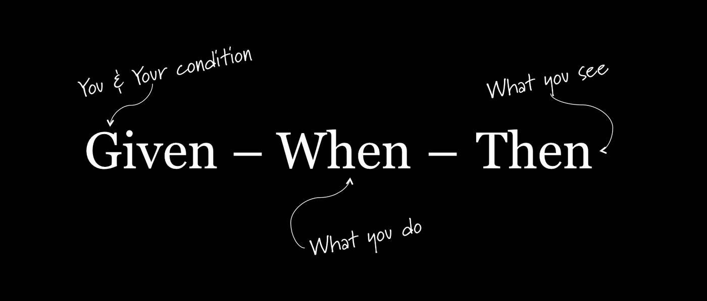

<!-- _class: lead -->
<style scoped>
img[alt~="given-when-then"] {
  display: block;
  margin: 0 auto;
}
</style>


---
<!-- paginate: true -->
<!-- footer: Tests unitaires-->
<!-- Qui peut me dire ce qu'est un test unitaire ?
Insistez sur l'importance de tester les unités de code individuellement pour garantir la qualité du code global.
 -->

# Qu'est-ce que le test unitaire ?


---
# Qu'est-ce que le test unitaire ?

- Le test unitaire est une technique de test logiciel qui vise à tester des unités individuelles de code.

- Une unité de code peut être une méthode, une classe ou un service.

- Les tests unitaires vérifient si le code se comporte comme prévu.

----
# Pourquoi les tests unitaires sont-ils importants ?

<!-- Utilisez l'image d'un bâtiment en construction pour illustrer l'importance des tests unitaires. Les tests unitaires constituent les fondations du bâtiment, et permettent de garantir sa solidité.
-->

----
# Pourquoi les tests unitaires sont-ils importants ?
<!-- Insistez sur le fait que les tests unitaires ne sont pas une solution miracle, mais un outil précieux pour améliorer la qualité du code. -->

Avantages:
- Détection précoce des bugs

- Réduction des coûts de développement

- Amélioration de la qualité du code

- Facilitation du refactoring

- Développement agile

---
# Limites des tests unitaires
<!-- Encouragez les élèves à réfléchir aux situations où les tests unitaires peuvent ne pas être suffisants. -->

Limites:

- Ne testent pas les interactions entre les unités de code

- Ne testent pas l'interface utilisateur

- Peuvent être longs à écrire et à maintenir

- Nécessitent des compétences techniques

---
<!-- Encouragez les élèves à réfléchir à la manière de décomposer un test unitaire en suivant la structure "Given-When-Then". -->
<!-- 
Given: Les ingrédients et les ustensiles nécessaires correspondent au contexte initial.
When: La préparation de la recette représente l'action à tester.
Then: Le résultat final correspond aux résultats attendus. -->
# Structure "Given-When-Then"
- Le pattern Given-When-Then est une structure standard pour écrire des tests unitaires.

- Il permet de clarifier l'intention du test et de le rendre plus facile à lire et à comprendre.

---
# Structure "Given-When-Then"

- Given:
  - Décrit l'état initial du système avant l'exécution du code à tester
  - Définit les conditions préalables et les données d'entrée

- When:
  - Décrit l'action qui est effectuée sur le système
  - Appel de la fonction ou de la méthode à tester

- Then:
  - Décrit les résultats attendus après l'exécution du code
  - Vérifie le comportement du système avec des assertions

---
# Structure "Given-When-Then"
<style scoped>
 code {
  /* Specify slide size */
    font-size: 40px;
}
</style>

```python
# Given
nombre1 = 10
nombre2 = 5

# When
resultat = additionner(nombre1, nombre2)

# Then
assert resultat == 15
```

---
# Bonnes pratiques

- **Atomicité**: Chaque test doit tester une seule unité de code.

- **Indépendance**: Les tests doivent être indépendants les uns des autres.

- **Lisibilité**: Les tests doivent être clairs et faciles à comprendre.

- **Précision**: Les assertions doivent être précises et spécifiques.

- **Automatisation**: Les tests doivent être automatisés pour faciliter leur exécution.

---
# Développer du code de qualité avec NestJS

- NestJS est un framework JavaScript pour le développement d'applications web et mobiles côté serveur.

- NestJS offre des fonctionnalités natives pour faciliter l'écriture de tests unitaires.

- Intégration de Jest et Supertest pour les tests unitaires et d'intégration.

- Dépendances injectables et mocks pour une meilleure testabilité.

---
# Les fonctionnalités de NestJS pour les tests unitaires
<!-- 
Jest documentation: https://jestjs.io/
Supertest documentation: https://www.npmjs.com/package/supertest
-->

- Jest: Framework de test populaire pour JavaScript

- Supertest: Outil pour tester les API HTTP

- Dépendances injectables: Facilite la création de mocks

- Mocks: Simulent le comportement des dépendances

---

# Ecrire un test en NodeJS
**Installation**

>$ npm i --save-dev @nestjs/testing


**Exemple**

Pour une classe ```cats.controller.ts``` nous allons avoir une classe ```cats.controller.spec.ts``` qui va contenir les tests.

---
# Ecrire un test en NodeJS

```Javascript
import { CatsController } from './cats.controller';
import { CatsService } from './cats.service';

describe('CatsController', () => {
  let catsController: CatsController;

  beforeEach(() => {
    catsController = new CatsController();
  });

  describe('findAll', () => {
    it('should return an array of cats', async () => {
      const result = ['miaou'];
      expect(await catsController.findAll()).toBe(result);
    });
  });
});
```

---
# Executer les tests

**Commande**
> npm run test:watch

**Activer le coverage**
```Javascript
    "collectCoverage": true,
    "coverageReporters": ["json", "html"],
```
> Dans le package.json

---
# Les mocks
**Objectif des Mocks :**
- Simuler le comportement de dépendances externes pour isoler la logique métier.

- Faciliter les tests en réduisant les dépendances aux éléments externes (bases de données, services tiers, etc.).

**Pourquoi utiliser des mocks ?**
- Tester en isolation.

- Améliorer la rapidité d'exécution des tests.

- Éviter les effets de bord.

---
# Types de Mocks

- **Mocks manuels** : Créés manuellement pour simuler le comportement.

- **Mocks automatiques** : Générés par des librairies comme Jest.

- **Spies** : Surveillent les appels d'une fonction réelle.

- **Fakes** : Fournissent une implémentation simplifiée.

---
# Création de Mocks dans NestJS
**Structure de base :**

- Utiliser jest.fn() pour créer un mock.

- Simuler des méthodes ou des dépendances avec des comportements personnalisés.

**Exemple :**
```typescript
const mockService = {
  findOne: jest.fn().mockResolvedValue({ id: 1, name: 'John Doe' }),
  create: jest.fn().mockImplementation(dto => ({ id: 2, ...dto })),
};
```
---
# Mock d’un Service
Supposons une classe UserService dépendant d’un UserRepository.
**Mock du dépôt**

```Typescript
const mockUserRepository = {
  findOne: jest.fn().mockResolvedValue({ id: 1, name: 'John Doe' }),
};
```
**Injecter le mock dans le service**
```Typescript
const mockUserRepository = {
  findOne: jest.fn().mockResolvedValue({ id: 1, name: 'John Doe' }),
};
```
---
# Mock dans les Tests Unitaires
**Test d’une méthode avec un mock**
```Typescript
it('should return a user', async () => {
  const user = await service.findOne(1);
  expect(user).toEqual({ id: 1, name: 'John Doe' });
  expect(mockUserRepository.findOne).toHaveBeenCalledWith(1);
});
```