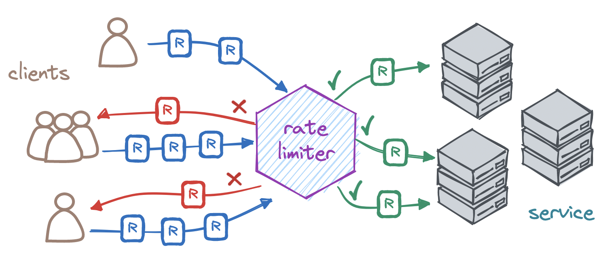

<!-- _class: lead -->
<style scoped>
img[alt~="rate"] {
  display: block;
  margin: 0 auto;
}
</style>


<!-- Premier tour de table pour savoir qui a déjà entendu parler de ces notions, et qui peut en parler. -->
---
<!-- paginate: true -->
<!-- footer: Rate limiting -->
# Qu'est-ce que le Rate Limiting ?

**Définition :**
Technique de contrôle qui limite le nombre de requêtes qu'un client peut envoyer à une API dans un laps de temps donné.

**Objectif :**
Empêcher les abus, préserver les performances et protéger contre certaines attaques.

**Exemple :**
“Un utilisateur peut effectuer un maximum de 100 requêtes par minute.”

---
# Pourquoi le Rate Limiting est-il important ?
**Prévenir les abus :**
Évite qu’un client malveillant ou une application défectueuse ne surcharge le système.

**Proteger contre les attaques :**
- DoS (Denial of Service) : Limite l’impact d’un grand nombre de requêtes malveillantes.
- Brute Force : Ralentit les tentatives de découverte de mots de passe.

**Améliorer l’équité :**
Assure que toutes les applications ou utilisateurs ont accès à une part équitable des ressources.

---
# Mécanismes de Fonctionnement
**Basés sur l’identification du client :**
- Adresse IP
- Token d’authentification.

**Stratégies courantes :**
- Fixed Window (Fenêtre fixe) :
	- Compte les requêtes sur des intervalles fixes (ex. : minute ou heure).
	- Limitation simple mais peut introduire des pics de trafic.
- Sliding Window (Fenêtre glissante) :
	- Évalue les requêtes sur une fenêtre de temps glissante.
	- Réduit les pics de trafic.
- Token Bucket (Seau de jetons) :
	- Permet une limite définie mais autorise des "explosions" ponctuelles.
	- Réduit progressivement les requêtes en cas d’abus.

---
# Mise en Oeuvre du Rate Limiting

1. Installer un middleware de rate limiting :
```bash
npm install @nestjs/throttler
```
2.Configurer la stratégie dans le projet :
```Javascript
import { ThrottlerModule } from '@nestjs/throttler';

@Module({
  ...
  imports: [
    ThrottlerModule.forRoot([{
      ttl: 60000,
      limit: 10,
    }]),
  ],
})
...
export class AppModule {}
```
---
# Mise en Oeuvre du Rate Limiting

3. Appliquer la limitation à un contrôleur ou à une route spécifique :
```Javascript
import { ThrottlerGuard } from '@nestjs/throttler';
import { UseGuards } from '@nestjs/common';

@UseGuards(ThrottlerGuard)
@Post()
@ApiOperation({ summary: 'Create a new user' })
@HttpCode(HttpStatus.CREATED)
create(@Body() createUserDto: CreateUserDto) {
  console.log("TOTO")
  return this.userService.create(createUserDto);
}
```

---
# Bonnes Pratiques pour le Rate Limiting
**Adapter les limites aux besoins :**
Différencier les limites pour les utilisateurs authentifiés, anonymes ou partenaires.

**Envoyer des métadonnées :**
- Informer les clients de leur statut avec les en-têtes HTTP :
	- X-RateLimit-Limit : Limite maximale autorisée.
	- X-RateLimit-Remaining : Requêtes restantes.
	- X-RateLimit-Reset : Temps restant avant la réinitialisation.

**Combiner avec d'autres protections :**
- Authentification JWT.
- WAF (Web Application Firewall).

---
# Conclusion
**Rate Limiting = Protection + Performance :**
Un outil essentiel pour réduire les abus, préserver les ressources et protéger contre des attaques courantes.

**Toujours tester les limites :**
Assurez-vous que les paramètres choisis conviennent à la charge attendue et ne nuisent pas à l’expérience utilisateur.

