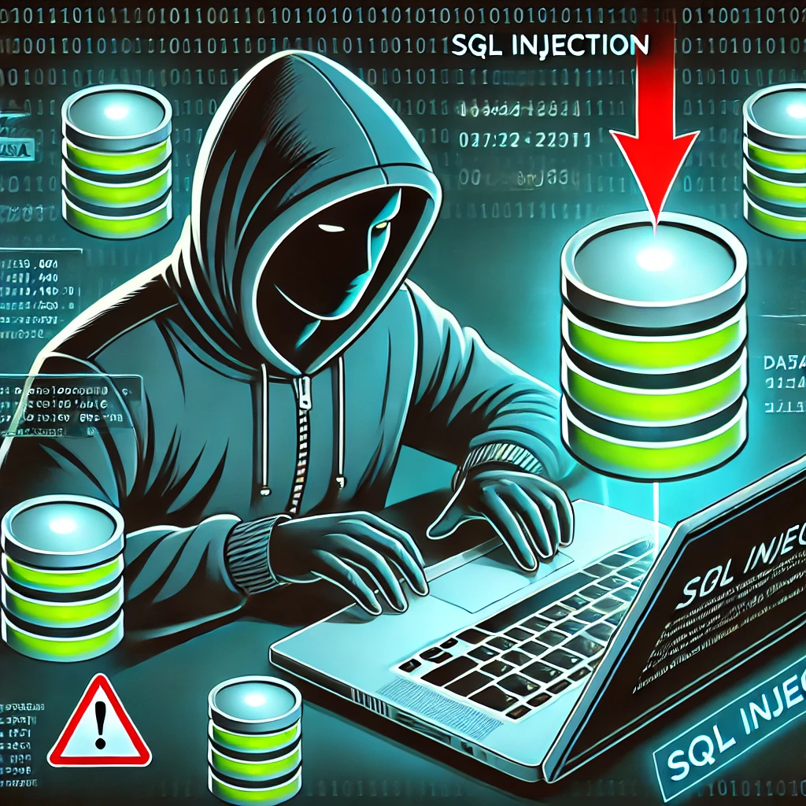

<!-- _class: lead -->
<style scoped>
img[alt~="auth"] {
  display: block;
  margin: 0 auto;
}
</style>


<!-- Premier tour de table pour savoir qui a déjà entendu parler de ces notions, et qui peut en parler. -->
---
<!-- paginate: true -->
<!-- footer: Rate limiting -->
# Qu'est-ce qu'une Injection SQL ?

**Définition :**
Une attaque qui exploite des failles dans une application pour exécuter des commandes SQL malveillantes.

**Objectif :**
Accéder, modifier ou supprimer des données non autorisées dans une base de données.


---
# Comment Fonctionne une Injection SQL ?
**Exploitation des entrées non sécurisées :**
- L'application insère des données utilisateur directement dans des requêtes SQL.
- Les attaquants injectent du code malveillant dans ces données

**Types courants d'injection  :**
- Injection basique : Ajout de conditions toujours vraies.
```SQL
' OR '1'='1
```
- Union-based : Combiner des requêtes malveillantes avec des requêtes légitimes.
```SQL
UNION SELECT credit_card_number FROM users;
```

---
# Conséquences d'une Injection SQL
**Violation de données sensibles :**
- Exfiltration d'informations confidentielles (mots de passe, données personnelles).

**Destruction de données :**
- Suppression ou modification non autorisée des données.

**Compromission du système :**
- Accès à des fonctions système critiques.

**Impact financier et légal :**
- Pertes financières et amendes pour non-conformité aux réglementations (ex. RGPD).

---
# Comment Prévenir les Injections SQL ?

**1. Utiliser des ORM**
- Préférez les outils comme Sequelize ou TypeORM pour éviter les requêtes SQL brutes.

**2. Requêtes préparées :**
- Remplacez les concaténations de chaînes par des requêtes paramétrées.
```Javascript
const query = 'SELECT * FROM users WHERE username = ? AND password = ?';
db.execute(query, [username, password]);
```

**3. Validation des entrées :**
- Filtrer et valider toutes les données des utilisateurs (frontend et backend).
---
# Comment Prévenir les Injections SQL ?
**4. Principes de Moindre Privilège :**

- Limiter les privilèges de l'utilisateur de la base de données (ex. : lecture seule).

**5. Journalisation et surveillance :**

- Détecter les tentatives d'injection grâce aux outils de monitoring.

---
# Bonnes Pratiques Supplémentaires

**Scanner de sécurité :**

Intégrer des outils comme Snyk pour identifier les vulnérabilités.

**Limiter l'accès à la base de données :**

Les applications ne devraient pas avoir un accès direct au schéma complet.

**Top 10 OWASP :**

Suivez les recommandations pour les vulnérabilités critiques liées à la sécurité.

---
# Conclusion
**Prévention :**
Utiliser des outils et bonnes pratiques comme les ORM, requêtes préparées et validation des entrées.

**Surveillance :**
Mettre en place un système de détection et de réaction rapide aux attaques.

**Éducation :**
Former les développeurs aux risques et aux solutions pour les éviter.

